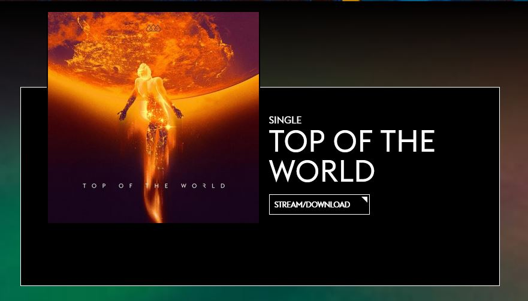

# Procesverslag
Markdown is een simpele manier om HTML te schrijven.  
Markdown cheat cheet: [Hulp bij het schrijven van Markdown](https://github.com/adam-p/markdown-here/wiki/Markdown-Cheatsheet).

Nb. De standaardstructuur en de spartaanse opmaak van de README.md zijn helemaal prima. Het gaat om de inhoud van je procesverslag. Besteedt de tijd voor pracht en praal aan je website.

Nb. Door *open* toe te voegen aan een *details* element kun je deze standaard open zetten. Fijn om dat steeds voor de relevante stuk(ken) te doen.

## Jij

uitwerken voor kick-off werkgroep

### Auteur:
Sanne 't Hooft

#### Je startniveau:
Rood

#### Je focus:
responsive
 

## Je website

uitwerken voor kick-off werkgroep

### Je opdracht:
http://www.thescoremusic.com/

#### Screenshot(s) van de eerste pagina (small screen): 
hier de naam van de pagina  

#### Screenshot(s) van de tweede pagina (small screen):
hier de naam van de pagina  

 

## Breakdownschets (week 1)

uitwerken na afloop 2e werkgroep

### de hele pagina: 

### dynamisch deel (bijv menu): 

## Voortgang 1 (week 2)

uitwerken voor 1e voortgang

### Stand van zaken
Ik heb er deze week voor gezorgd dat alle html aanwezig is op de pagina. Alle content staat erin en ik ben al begonnen met het stylen van de pagina.
Ik zat wel vast bij het maken van de linear gradient over de bakcground image heen. Ik heb uiteindelijk hulp gezocht en toen is het gelukt. 
Het werkte uiteindelijk niet omdat ik een spatie teveel had neergezet. Dit had ik zelf niet gezien en daarom begreep ik het niet.
Hieronder de bijbetrefende code:

### Agenda voor meeting
samen met je groepje opstellen

Joppe: Html structuur & Positionering 
Maeren: Nette html & Css positionering 
Leo: Animaties, Positioneren en Info opslaan 
Timo: Responsiveness & Positionering 

### Verslag van meeting
hier na afloop snel de uitkomsten van de meeting vastleggen

- Media query gebruiken
- Even letten op de structuur

## Voortgang 2 (week 3)

uitwerken voor 2e voortgang

### Stand van zaken
Deze week heb ik vooral gekeken naar 1 stukje op mijn site. Dit gaat over het stukjes waar de nieuwste single van de band wordt laten zien. Dit vond ik erg lastig omdat deze er heel anders uitziet op dekstop dan op mobiel. Ik had hier moeite mee omdat dit de eerste keer was dat ik media query's ging gebruiken. Zie hieronder de code:

Code:

### Agenda voor meeting
samen met je groepje opstellen

Joppe: Grid/flexbox 
Maeren:Nette html zonder id/class & positioneren 
Leo: Media query's & selectoren voor meerdere pagina's 
Timo: Media query's 

### Verslag van meeting
hier na afloop snel de uitkomsten van de meeting vastleggen
Werken aan media query's

## Toegankelijkheidstest (week 4)

uitwerken na test in 8e voortgang

### Bevindingen
Lijst met je bevindingen die in de test naar voren kwamen:
Het knopje van het hamburger menu is erg klein.
De checkboxes zijn er klein
Het inschrijven voor de nieuwsbrief is erg lastig.

Sommige afbeeldingen of tekst kan niet geselecteerd worden door met tab te werken
Opgelost door er een link van te maken.

Before & After

Met de narrator gaat de site prima. 

## Voortgang 3 (week 4)

uitwerken voor 3e voortgang

### Stand van zaken
hier dit ging goed & dit was lastig (neem ook screenshots op van delen van je website en code)

### Agenda voor meeting
samen met je groepje opstellen

| student 1      | student 2          | student 3    | student 4        |
| ---            | ---                | ---          | ---              |
| dit bespreken  | en dit             | en ik dit    | en dan ik dat    |
| en dat ook nog | dit als er tijd is | nog een punt | dit wil ik zeker |
| ...            | ...                | ...          | ...              |

### Verslag van meeting
hier na afloop snel de uitkomsten van de meeting vastleggen

- punt 1
- punt 2
- nog een punt
- ...

## Eindgesprek (week 5)

uitwerken voor eindgesprek

### Stand van zaken
hier dit ging goed & dit was lastig (neem ook screenshots op van delen van je website en code)

### Screenshot(s)

hier screenshot(s) van je eindresultaat

## Bronnenlijst

continu bijhouden terwijl je werkt

Nb. Wees specifiek ('css-tricks' als bron is bijv. niet specifiek genoeg).

1. bron 1
2. bron 2
3. ...

